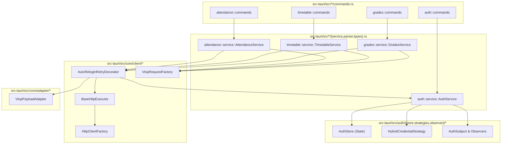
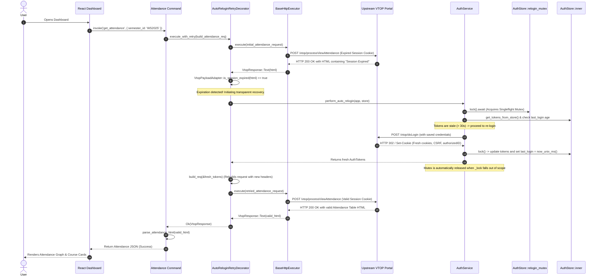
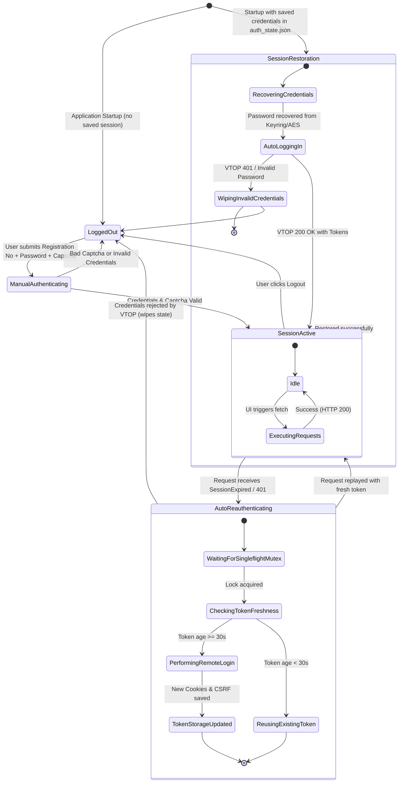

# 02. UML Diagrams & Object Models

This document specifies the object-oriented and structural models of the Deskly backend using standard UML diagrams implemented in Mermaid.

---

## 1. Complete UML Class Diagram

The following class diagram models the core structs, traits, relationships, and methods across the Deskly backend:

```mermaid
classDiagram
    direction TB

    %% Traits & Interfaces
    class VtopExecutor {
        <<trait>>
        +execute(request: &VtopRequest) Result~VtopResponse, BackendError~*
    }

    class AuthObserver {
        <<trait>>
        +on_auth_event(event: &AuthEvent, app: &AppHandle, auth: &PersistedAuth)*
    }

    class CredentialStrategy {
        <<trait>>
        +recover_password(user_id: &str, encrypted_fallback: Option~&str~) Result~(String, bool), BackendError~*
        +encrypt_password(password: &str) Result~String, BackendError~*
    }

    %% Core Client & Decorator
    class BaseHttpExecutor {
        -client: reqwest::Client
        +new() Result~Self, BackendError~
        +execute(request: &VtopRequest) Result~VtopResponse, BackendError~
    }

    class AutoReloginRetryDecorator {
        -inner: E
        -app: &AppHandle
        -store: &State~AuthStore~
        +new(inner: E, app: &AppHandle, store: &State~AuthStore~) Self
        +execute_with_retry(build_req: F) Result~VtopResponse, BackendError~
    }

    class HttpClientFactory {
        <<singleton>>
        -SHARED_CLIENT: Lazy~Result~Client, String~~$
        +create_client() Result~Client, BackendError~$
    }

    class VtopRequestFactory {
        <<factory>>
        +endpoint_url(endpoint: &str) String$
        +create_form_request(endpoint: &str, custom_params: Vec, tokens: &AuthTokens) VtopRequest$
        +create_multipart_request(endpoint: &str, fields: Vec, tokens: &AuthTokens) VtopRequest$
        +create_download_request(endpoint: &str, custom_params: Vec, tokens: &AuthTokens, fallback: String) VtopRequest$
    }

    class VtopRequest {
        <<enumeration>>
        Form(url, headers, form_params)
        Multipart(url, headers, fields)
        Download(url, headers, form_params, fallback_filename)
    }

    class VtopResponse {
        <<enumeration>>
        Text(String)
        Binary(filename, bytes)
        +into_text() Result~String, BackendError~
        +into_binary() Result~(String, Vec~u8~), BackendError~
    }

    class VtopPayloadAdapter {
        <<adapter>>
        +is_session_expired(html: &str) bool$
        +extract_csrf(html: &str) Option~String~$
        +extract_authorized_id(html: &str) Option~String~$
        +has_captcha_error(html: &str) bool$
    }

    %% Auth & State Store
    class AuthStore {
        +inner: std::sync::Mutex~PersistedAuth~
        +relogin_mutex: tokio::sync::Mutex~()~
        +new(initial: PersistedAuth) Self
    }

    class PersistedAuth {
        +state: Option~AuthState~
        +tokens: Option~AuthTokens~
        +semester: Option~SemesterInfo~
        +password_encrypted: Option~String~
    }

    class AuthTokens {
        +csrf: String
        +authorized_id: String
        +cookies: String
        +is_complete() bool
    }

    class AuthState {
        +user_id: String
        +logged_in: bool
        +last_login: i64
    }

    class AuthService {
        <<service>>
        +login(app: &AppHandle, store: &State~AuthStore~, credentials) Result~AuthState, BackendError~$
        +perform_auto_relogin(app: &AppHandle, store: &State~AuthStore~) Result~AuthTokens, BackendError~$
        +get_tokens_from_store(store: &State~AuthStore~) Result~AuthTokens, BackendError~$
        +restore_session(app: &AppHandle, store: &State~AuthStore~) Result~Option~AuthState~, BackendError~$
        +logout(app: &AppHandle, store: &State~AuthStore~) Result~bool, BackendError~$
    }

    class AuthSubject {
        -observers: Vec~Box~dyn AuthObserver~~
        +new() Self
        +register(observer: Box~dyn AuthObserver~)
        +notify(event: &AuthEvent, app: &AppHandle, auth: &PersistedAuth)
    }

    class DiskPersistenceObserver {
        +on_auth_event(event: &AuthEvent, app: &AppHandle, auth: &PersistedAuth)
    }

    class HybridCredentialStrategy {
        +recover_password(user_id: &str, encrypted_fallback: Option~&str~) Result~(String, bool), BackendError~$
        +encrypt_password(password: &str) Result~String, BackendError~$
    }

    %% Domain Service Example
    class AttendanceService {
        <<service>>
        +get_attendance(app: &AppHandle, store: &State~AuthStore~, semester_id: Option~String~) Result~AttendanceResponse, BackendError~$
    }

    %% Relationships & Realizations
    VtopExecutor <|.. BaseHttpExecutor : implements
    VtopExecutor <|.. AutoReloginRetryDecorator : wraps/delegates
    AutoReloginRetryDecorator *-- BaseHttpExecutor : contains inner
    AutoReloginRetryDecorator ..> AuthService : invokes perform_auto_relogin
    AutoReloginRetryDecorator ..> VtopPayloadAdapter : checks session expiry
    BaseHttpExecutor ..> HttpClientFactory : obtains pooled client
    BaseHttpExecutor ..> VtopRequest : consumes
    BaseHttpExecutor ..> VtopResponse : produces

    AuthStore *-- PersistedAuth : contains
    PersistedAuth *-- AuthTokens : contains
    PersistedAuth *-- AuthState : contains

    AuthService ..> AuthStore : reads & updates
    AuthService ..> HybridCredentialStrategy : retrieves credentials
    AuthService ..> AuthSubject : emits lifecycle events

    AuthObserver <|.. DiskPersistenceObserver : implements
    AuthSubject o-- AuthObserver : manages subscribers

    AttendanceService ..> AutoReloginRetryDecorator : uses for requests
    AttendanceService ..> VtopRequestFactory : builds requests
```

---

## 2. Module & Package Architecture Diagram

The backend divides concerns into clear, bounded contexts:

---

## 3. Sequence Diagram: Transparent Auto-Relogin

The sequence below illustrates what happens when a protected resource fetch encounters an expired session:

---

## 4. State Machine Diagram: Authentication Session Lifecycle

This diagram documents the lifecycle states of a user session in Deskly:

