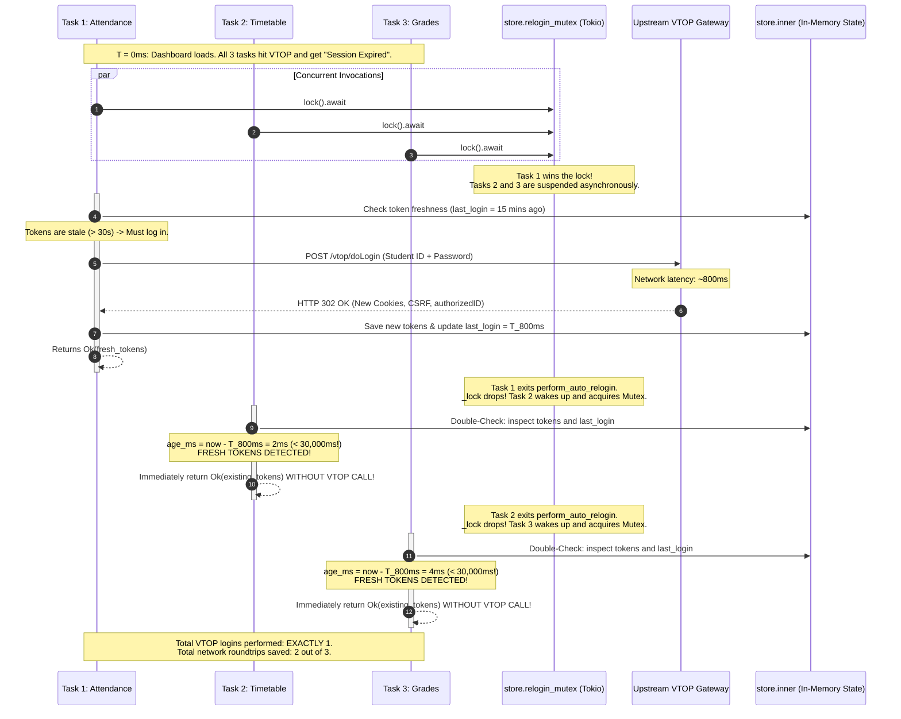

# 03. Singleflight Mutex & Concurrency Architecture

This document provides an in-depth low-level design analysis of Deskly's **Singleflight Auto-Relogin Mutex** system. It explains the distributed concurrency pitfalls of legacy web portals, how Deskly prevents the **Thundering Herd / Token Stampede Problem**, and how double-checked locking guarantees exactly-once authentication across parallel resource requests.

---

## 1. The Core Problem: The Thundering Herd / Token Stampede

In modern desktop applications built with reactive UI frameworks (React 19, TanStack Query), pages load multiple independent widgets simultaneously. 

### The Real-World Scenario:
When a student opens the Deskly **Dashboard**, the frontend fires 4 to 5 concurrent asynchronous IPC calls:
1. `get_attendance(semester_id)`
2. `get_timetable(semester_id)`
3. `get_cgpa_details()`
4. `get_academic_calendar()`
5. `get_profile()`

### What Happens When a Session Expires:
VTOP terminates user sessions after a period of inactivity (typically 15 minutes). If the user opens or refreshes the Dashboard after this window:
- All 5 concurrent HTTP requests arrive at VTOP with an expired session cookie.
- VTOP responds to all 5 requests with an HTTP 401/403 or an HTML redirect containing `"Session Expired"`.
- Each request handler detects that its session is invalid and attempts to recover by calling an auto-relogin routine.

### The Catastrophic Failure Without Synchronization (The Stampede):
```
[Widget: Attendance]  ──(Expired)──> [Auto-Relogin #1] ──> POST /vtop/doLogin ──┐
[Widget: Timetable]   ──(Expired)──> [Auto-Relogin #2] ──> POST /vtop/doLogin ──┤ 5 Concurrent Logins
[Widget: Grades]      ──(Expired)──> [Auto-Relogin #3] ──> POST /vtop/doLogin ──┤ to Legacy VTOP Server!
[Widget: Calendar]    ──(Expired)──> [Auto-Relogin #4] ──> POST /vtop/doLogin ──┤
[Widget: Profile]     ──(Expired)──> [Auto-Relogin #5] ──> POST /vtop/doLogin ──┘
```

Without synchronization, 5 distinct login attempts hit the legacy university server simultaneously. This creates catastrophic issues:
1. **Account Lockouts**: VTOP's security heuristic flags rapid concurrent authentication attempts from the same student ID as a brute-force or credential-sharing attack, temporarily locking the student's account.
2. **Captcha Challenges**: VTOP’s bot detection is triggered, invalidating password-only logins and demanding interactive CAPTCHAs.
3. **Session Cookie Race Conditions**: When login #1 completes, VTOP issues Cookie Set $A$. When login #2 completes 50ms later, VTOP issues Cookie Set $B$ and **invalidates** Cookie Set $A$. Request #1 attempts to use Cookie Set $A$, fails again, and causes an infinite auto-relogin loop.
4. **Server Degradation**: Multiplies network and compute load on an already fragile university portal.

---

## 2. The Solution: Singleflight Mutex with Double-Checked Locking

To solve this, Deskly implements the **Singleflight Pattern** combined with **Double-Checked Locking** inside `src-tauri/src/auth/store.rs` and `src-tauri/src/auth/service.rs`.

### Structural Definition (`src-tauri/src/auth/store.rs`):

```rust
pub struct AuthStore {
    // Guards in-memory data structures (tokens, user state, cached semester)
    pub(crate) inner: std::sync::Mutex<PersistedAuth>,

    // Serializes concurrent auto-relogin executions
    pub(crate) relogin_mutex: tokio::sync::Mutex<()>,
}
```

### Algorithmic Implementation (`src-tauri/src/auth/service.rs`):

```rust
pub async fn perform_auto_relogin(
    app: &AppHandle,
    store: &State<'_, AuthStore>,
) -> Result<AuthTokens, BackendError> {
    // STEP 1: Singleflight Serialization
    // Acquire the asynchronous mutex. Exactly ONE task enters; all others await here.
    let _lock = store.relogin_mutex.lock().await;

    // STEP 2: Double-Checked Locking
    // Now that we hold the lock, check if another task already completed the re-login
    // while we were waiting in the queue.
    if let Ok(existing_tokens) = Self::get_tokens_from_store(store) {
        if has_complete_tokens(&existing_tokens) {
            let guard = store
                .inner
                .lock()
                .map_err(|_| BackendError::StorageError("failed to lock auth store".to_string()))?;
            if let Some(state) = guard.state.as_ref() {
                let age_ms = now_unix_ms().saturating_sub(state.last_login);
                // If tokens were generated less than 30 seconds ago, REUSE THEM IMMEDIATELY!
                if age_ms < 30_000 {
                    return Ok(existing_tokens);
                }
            }
        }
    }

    // STEP 3: Recover Credentials
    let (user_id, password, should_repair_encrypted) = {
        let guard = store.inner.lock().map_err(...)?;
        let user_id = guard.state.as_ref().unwrap().user_id.clone();
        let (pwd, needs_repair) = HybridCredentialStrategy::recover_password(
            &user_id,
            guard.password_encrypted.as_deref(),
        )?;
        (user_id, pwd, needs_repair)
    };

    // STEP 4: Execute Upstream Network Login (Only 1 task ever reaches here!)
    let tokens = Self::internal_login(&user_id, &password).await?;

    // STEP 5: Commit New Tokens & Update Timestamp
    {
        let mut guard = store.inner.lock().map_err(...)?;
        guard.tokens = Some(tokens.clone());
        if let Some(state) = guard.state.as_mut() {
            state.last_login = now_unix_ms(); // Sets fresh timestamp
        }
        let subject = AuthSubject::new();
        subject.notify(&AuthEvent::TokensRefreshed { tokens: tokens.clone() }, app, &guard);
    }

    // STEP 6: Release Lock
    // _lock drops automatically when exiting function scope, unblocking waiting tasks
    Ok(tokens)
}
```

---

## 3. Detailed Concurrency Sequence Timeline

The diagram below maps the precise execution timeline when 4 parallel tasks hit session expiration simultaneously:



---

## 4. Deadlock Prevention & Lock Hierarchy

Deskly operates in a hybrid synchronous/asynchronous environment. Mixing `std::sync::Mutex` and `tokio::sync::Mutex` without strict discipline can cause catastrophic deadlocks or thread starvation.

### Deadlock Hazards in Rust Async:
If a thread holds a `std::sync::MutexGuard` across an `.await` point:
1. The task yields execution back to the Tokio runtime worker pool.
2. Another task scheduled on the same OS thread attempts to lock the same `std::sync::Mutex`.
3. The OS thread blocks waiting for a lock held by a task that cannot resume until that very OS thread is free $\rightarrow$ **Threadpool Deadlock**.

### Deskly’s Architectural Invariants:
1. **Never hold `store.inner` across `.await`**:
   `store.inner` is locked only within synchronous, non-yielding blocks:
   ```rust
   // CORRECT: Scoped lock dropped before any network call
   let user_id = {
       let guard = store.inner.lock().unwrap();
       guard.state.as_ref().unwrap().user_id.clone()
   }; // <- guard dropped here!

   // Safe to await now
   let tokens = Self::internal_login(&user_id, &password).await?;
   ```
2. **Strict Lock Ordering**:
   If an operation requires both locks, the acquisition order is **always**:
   $$\text{relogin\_mutex (tokio)} \longrightarrow \text{inner (std::sync)}$$
   No code path is ever permitted to acquire `relogin_mutex` while holding `inner`.

---

## 5. The 30-Second Freshness Window Rationale

The double-checked condition checks:
```rust
let age_ms = now_unix_ms().saturating_sub(state.last_login);
if age_ms < 30_000 {
    return Ok(existing_tokens);
}
```

### Why 30 Seconds?
- **Network Flight Buffer**: Under slow university Wi-Fi or high server load, an auto-relogin handshake may take 2 to 5 seconds to complete. If a batch of 10 requests is queued, the last task might not acquire the mutex until 5–10 seconds after the first login succeeded. A 30-second window comfortably encompasses the execution span of all co-scheduled tasks.
- **Immediate Invalidation Guard**: If a session was legitimately terminated by the user or an administrative logout, 30 seconds is short enough that normal user navigation won't accidentally treat a dead session as "fresh" after legitimate manual re-authentication.
- **Clock Drift Safety**: Uses `saturating_sub` to prevent integer underflows in the rare event of minor local system time corrections.
