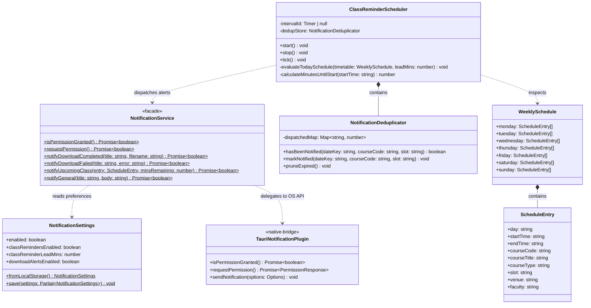
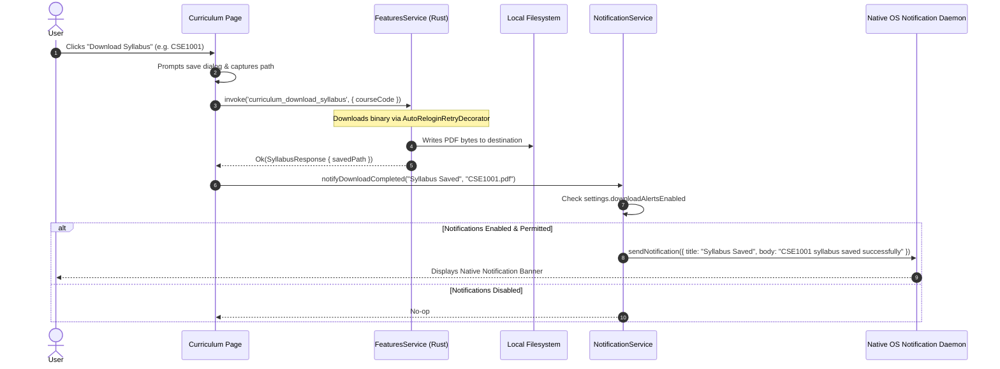
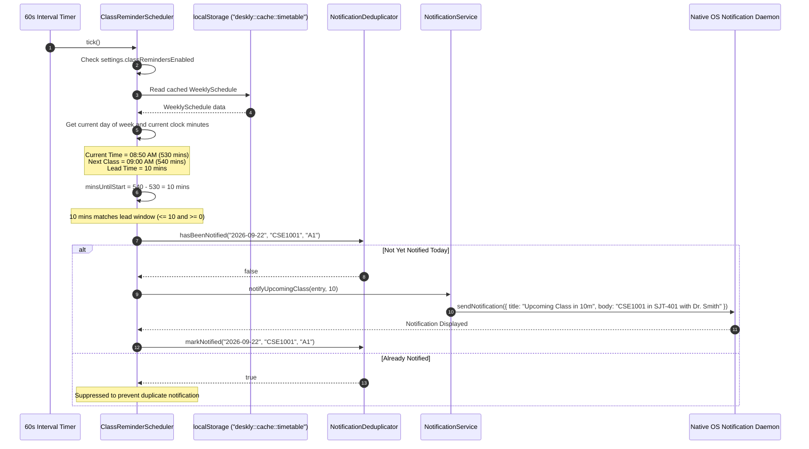
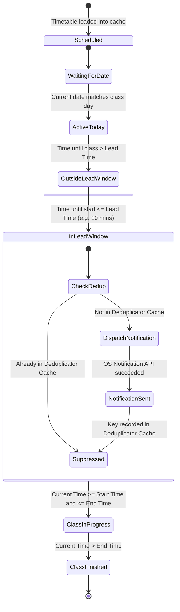

# 06. Native Notifications & Scheduling LLD

This document specifies the Low-Level Design (LLD) for Deskly's native OS notification subsystem and automated class reminder engine. It covers notification lifecycles, event decoupling, scheduling evaluation, anti-spam deduplication, and cross-platform notification dispatch.

---

## 1. Architectural Scope & Problem Statement

Desktop and mobile users require timely system-level feedback outside the active application viewport:
1. **Asynchronous File Downloads**: Long-running operations like syllabus document retrieval, academic calendar exports, and auto-updater chunk downloads must notify the student when complete, even if Deskly is minimized or behind other windows.
2. **Upcoming Class Reminders**: Students need proactive alerts before their scheduled classes commence (e.g. 5, 10, or 15 minutes before the lecture/lab starts), with accurate course titles, classroom/venue numbers, and faculty details.
3. **Anti-Spam & Deduplication**: Timetable evaluation ticks must never trigger repeated duplicate notifications for the same class session on the same day.
4. **User Sovereignty & Permission Management**: Users must have granular control over notification categories, lead times, and global opt-outs in Settings, adhering to OS-level notification permissions (Windows Action Center, macOS NotificationCenter, Linux D-Bus `org.freedesktop.Notifications`, Android NotificationManager).

---

## 2. UML Class Diagram

The following diagram defines the component architecture, data contracts, and structural relationships of the notification engine:

---

## 3. Detailed UML Sequence Diagrams

### 3.1 Download Completion Notification Sequence

This sequence models the asynchronous download of a curriculum syllabus and the resulting native OS banner:

---

### 3.2 Upcoming Class Reminder Scheduling Sequence

This sequence illustrates the periodic evaluation cycle detecting an approaching lecture:

---

## 4. State Machine Diagram: Class Reminder Lifecycle

The following state machine tracks the lifecycle of an individual scheduled class on any given calendar date:

---

## 5. Design Patterns Applied

### 5.1 Facade Pattern (`NotificationService`)
- **Intent**: Provide a unified, high-level interface over low-level Tauri notification bindings and browser fallback mechanisms.
- **Benefits**: Callers (Curriculum page, Calendar exporter, Updater, Class scheduler) do not need to check raw OS permissions, parse error strings, or verify JSON settings independently.

### 5.2 Scheduler Pattern (`ClassReminderScheduler`)
- **Intent**: Decouple periodic evaluation of time-based triggers from the user interface rendering lifecycle.
- **Benefits**: Operates via a root-mounted background hook in `_app.tsx`. Consumes negligible CPU (<0.01% on an idle 60-second timer) and does not trigger React component re-renders unless state changes.

### 5.3 Idempotency & Deduplication Pattern (`NotificationDeduplicator`)
- **Intent**: Guarantee exactly-once delivery of notifications for any single discrete academic session.
- **Mechanism**: Keys entries as `${YYYY-MM-DD}_${courseCode}_${slot}`. Retains a rolling 24-hour expiration buffer to discard stale keys automatically upon date rollover.

---

## 6. Extensibility: Adding Future Notification Triggers

The notification architecture is open for extension without modifying existing notification dispatch logic:

1. **Exam Schedule Reminders**:
   - Ingest `deskly::cache::exams`.
   - Add `evaluateUpcomingExams()` to check for exams scheduled within 24 hours.
   - Dispatch via `NotificationService::notifyGeneral("Upcoming Exam Tomorrow", body)`.
2. **Attendance Low Threshold Warnings**:
   - When attendance records sync from VTOP, inspect if any course drops below 75%.
   - Trigger alert: `NotificationService::notifyGeneral("Attendance Warning", "CSE1001 dropped to 74%")`.
3. **Grade Publication Alerts**:
   - On background auto-relogin or session restore, compare cached grades count with fresh grades count.
   - Trigger alert if new course grades have been published.
