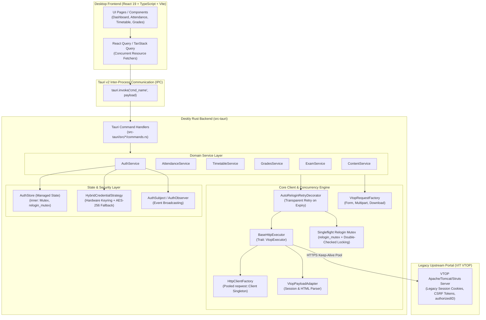

# Deskly Backend Low-Level Design (LLD) Documentation

Welcome to the Low-Level Design (LLD) specification for the **Deskly** desktop backend (Tauri v2 + Rust).

Deskly bridges modern desktop user interfaces (React + TypeScript) with the legacy Vellore Institute of Technology (VIT) Online Portal (**VTOP**), which runs on an enterprise Java/Struts web architecture. This backend is engineered for high concurrency, zero session dropouts, safe credential management, and robust error recovery.

---

## Document Index

| Document | Topic | Key Focus Areas |
| :--- | :--- | :--- |
| [**01. Architecture Overview**](./01-architecture-overview.md) | System Structure & Tiers | Tauri IPC architecture, domain service separation, core client engine, thread safety, and unified error handling hierarchy. |
| [**02. UML Diagrams**](./02-uml-diagrams.md) | Object Models & Workflows | Mermaid Class diagrams, Package diagrams, Sequence diagrams (Authentication, Auto-relogin, Request retries), and State machines. |
| [**03. Singleflight Mutex & Concurrency**](./03-singleflight-mutex-and-concurrency.md) | Thundering Herd Solution | Detailed analysis of `relogin_mutex`, double-checked locking, token age validation (`age_ms < 30_000`), and deadlock prevention across concurrent resource fetches. |
| [**04. Design Patterns**](./04-design-patterns.md) | Enterprise Design Patterns | Decorator, Singleflight, Factory, Adapter, Strategy, Observer, and Singleton patterns implemented in idiomatic Rust. |
| [**05. Extensibility Guide**](./05-extensibility-guide.md) | Developer Guide | Step-by-step manual for adding new VTOP endpoints, custom parsers, IPC commands, and error mappers following SOLID principles. |
| [**06. Native Notifications & Scheduling**](./06-native-notifications-and-scheduling-lld.md) | Notifications & Reminders LLD | Low-level design for native OS notifications, download alert workflows, upcoming class reminder scheduler, deduplication, and user preferences. |

---

## High-Level System Context

---

## Architectural Guarantees & Constraints

1. **Zero Session Disruption**: When VTOP invalidates a session (typically after 15–20 minutes of inactivity or server-side expiration), running or parallel requests do not crash. They transparently re-authenticate and complete their original data fetch without notifying or bothering the end user.
2. **Singleflight Concurrency Protection**: Multiple concurrent resource requests from a single page view (e.g., Dashboard loading Attendance, Timetable, CGPA, and Exam Schedule simultaneously) are serialized through an asynchronous mutex with double-checked token freshness. Exactly **one** re-login HTTP handshake is dispatched, eliminating account lockouts and IP throttling.
3. **Defense-in-Depth Credential Security**: User passwords are encrypted in OS-level hardware secure keyrings (Secret Service API on Linux, DPAPI on Windows, Keychain on macOS). When keyrings are unavailable or corrupted, Deskly falls back to machine-keyed AES-256 encrypted local storage with automatic self-repair.
4. **Clean Decoupling (Hexagonal/Ports & Adapters)**: Upstream changes in VTOP HTML structures are isolated entirely inside Adapters and Parsers. Commands and UI components remain pristine and resilient against backend format shifts.
